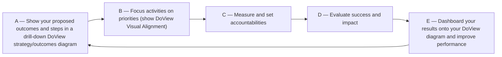
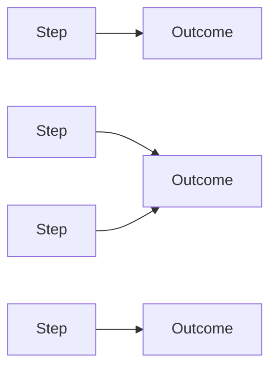
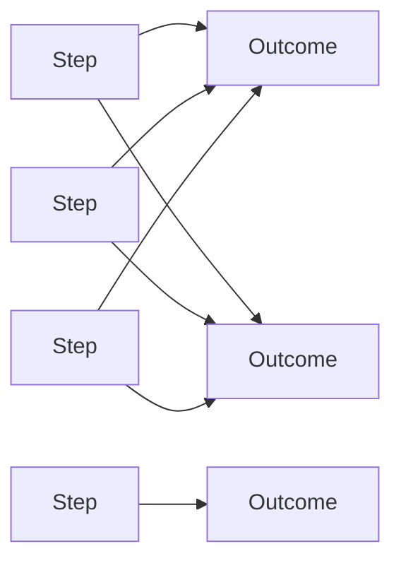

Relevant images from the DoView Planning and Outcomes Theory Handbook, Duignan, P. (2025),
https://doviewplanning.org/book

This image-retrieval response attempts to display the most relevant original images from the permitted handbook and tool pages. Image display depends on the AI system's technical ability to embed images from source URLs. Some relevant images may appear directly in the chat, while others may only be available as full visible plain-text image URLs.

---

1. Image or diagram title/caption: The Five Steps in DoView Planning (Tool A1)
2. Page URL:
https://doviewplanning.org/a1doviewtool
3. doview-book chapter URL:
https://github.com/cgbarlow/doview-book/tree/main/docs/md/Part%20A%20-%20DoView%20Planning%20Fundamentals/A01%20-%20The%20Five%20Steps%20in%20DoView%20Planning/a01tool.md
4. Mermaid (primary):

5. Image file URL: not separately published as a raw image-file URL on the permitted tool page; the diagram appears embedded within the page at https://doviewplanning.org/a1doviewtool
6. Original image:
The relevant image was identified, but this AI system cannot faithfully display or embed the original image here. The page URL above provides the canonical visual; the Mermaid block above is the faithful structural reproduction from the doview-book chapter.
7. Formal relevance note: Tool A1 was cited in the previous outcomes-theory answer as the canonical statement of the five DoView planning steps (A–E) and their cyclic relationship. The diagram is the central visual anchor for that argument.

---

1. Image or diagram title/caption: Do Not Silo Steps Under Outcomes — Siloed (A) vs Not-Siloed/Many-to-Many (B) (Tool B16)
2. Page URL:
https://doviewplanning.org/b16doviewtool
3. doview-book chapter URL:
https://github.com/cgbarlow/doview-book/tree/main/docs/md/Part%20B%20-%20DoView%20Drawing%20and%20Strategy%20Principles/B16%20-%20Do%20Not%20Silo%20Steps%20Under%20Outcomes%20Explainer/b16tool.md
4. Mermaid (primary):

A — Siloed (each step links to only one outcome)

B — Not siloed (steps can link to multiple outcomes; many-to-many)

5. Image file URL: not separately published as a raw image-file URL on the permitted tool page; the diagram appears embedded within the page at https://doviewplanning.org/b16doviewtool
6. Original image:
The relevant image was identified, but this AI system cannot faithfully display or embed the original image here. The page URL above provides the canonical visual; the Mermaid block above is the faithful structural reproduction from the doview-book chapter.
7. Formal relevance note: Tool B16 was cited in the previous outcomes-theory answer to support the principle that steps must not be siloed under single outcomes; the paired (A) siloed vs (B) many-to-many diagrams are the direct visual demonstration of that principle.

---

Duignan, P. (2025). DoView Planning and Outcomes Theory Handbook: 100+ Innovative, Integrated Tools for Solving Key Issues in Planning, Implementation, Contracting, Measurement, Evaluation and Reporting (for Humans and AI Agents). DoViewPlanning.Org.
https://doviewplanning.org/book
